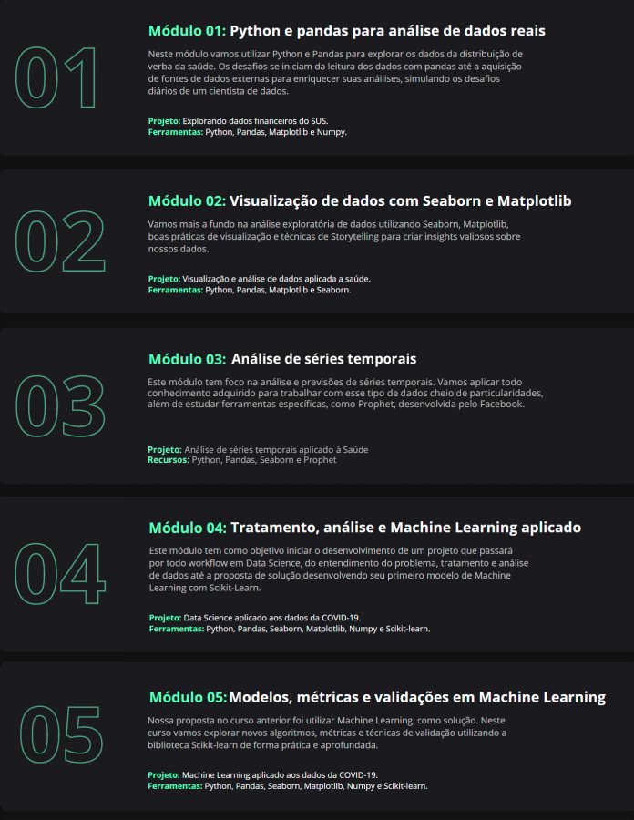

# Bootcamp Data Science Aplicada

Por [Gabriel Estafocher Medeiros](https://github.com/GabrielMedeiros32)

Bem vindo, neste repositório você terá acesso aos Módulos e Projetos produzidos durante os de 3 meses do curso da [Alura Cursos Online](https://www.alura.com.br/) na forma de Notebooks do Google Colaboratory

Esse curso é organizado segundo a seguinte ementa:

Além disso são criados projetos de pesquisa para o portfólio encontrados na pasta "Projetos" sendo eles:

1 - [Análise dos casos de Covid frente à vacinação, um estudo de caso de Israel e Reino Unido](https://github.com/GabrielMedeiros32/Bootcamp_Data_Science/blob/main/M%C3%B3dulo%201/BootcampM%C3%B3dulo1.ipynb)
